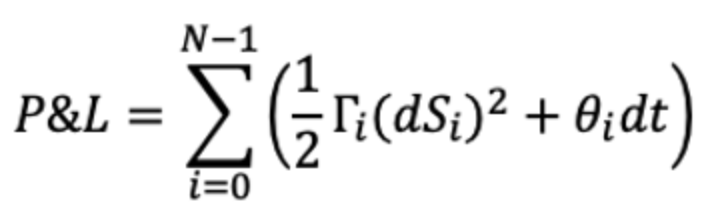

# Quantitative Finance Examples in ISO C++ Parallelism

This project contains two sample applications relevant to quantitative finance.
These examples are intended to demonstrate how ISO C++ can be used to write code
parallel code that is portable to CPUs and GPUs. This code is intended solely
for illustration and should not be used in production environments.

## Example Code

### Black-Scholes Model

In the first example, we consider a large universe of options, generated by sampling option strikes, maturities, and volatilities on a 3D grid. The Black-Scholes valuation of calls and puts with these parameters is perfectly parallelizable, so
it scales well to multicore CPUs or GPUs. A CPU baseline code is provided and
parallelized with OpenMP. The Black-Scholes calculation is contained within the
[`BlackScholesBody`](BSM.hpp#L153) function so that it can be reused between the
baseline code and the code using C++ Parallel Algorithms.

<div align="center">
<figure>
  
  <figcaption style="text-align: center;">Sampling grid for our options universe.</figcaption>
</figure>
</div>

#### Baseline Code
The baseline loops over options are contained in 
[`BlackScholesCPU`](BlackScholes_reference.cpp#L37). To expose all available
parallelism via OpenMP a `collapse(2)` clause is used. Different OpenMP
compilers may prefer other parallelization schemes for these loops, but that it
outside of the scope of this example.

#### C++ Parallel Algorithms Code
The parallel algorithms version of the code appears in
[`BlackScholesStdPar`](BlackScholes_stdpar.hpp#L46) and has a number of
small changes to utilize modern C++ features.

##### C++ span
Note that rather than taking raw pointers for input and output arrays more
modern span objects are used. These objects provide non-owning views
into the data, meanging that these views do not control the lifetime of the data
but rather provide a well-defined view into the data. They also carry metadata
about the data structure. For instance, rather than passing the number of
options as a parameter to the function, it can be inferred from the data 
structure, as seen on line [56](BlackScholes_stdpar.hpp#L56).

##### Iota Views
While the original code iterates from `0` to `optN`, the updated code uses an
`iota` view of these bounds. Conceptually, an `iota` is a list of all iteration
indices, except they are not actually stored in memory but rather calcuated in
the fly. This is a convenient way to accomplish the same iteration space as the
original loops when using C++ parallel algorithms. 

##### The `for_each` Algorithm and `par_unseq` Execution Policy
Finally, the feature that replaces serial `for` loops with something that can be
run in parallel is the `std::for_each` algorithm. As the name implies, this
algorithm will apply the same operation _for each_ index in the `iota` view
created above. The final argument to `for_each` in the example code is a lambda
function, inside which the original `BlackScholesBody` function is called.
Each time the lambda function is called, it is passed a single parameter, an
integer value from the `iota`, which serves the same purpose as a loop index in
the original code. 

Since C++17 standard algorithms accept an optional first argument, which is an
execution policy. This instructs the compiler about how the code can be
executed. For instance `std::execution::seq` would instruct the compiler that
the code must be run in a sequential order, like in a `for` loop. Using
`std::execution::par` instructs the compiler that the code may be parallelized,
but within each thread executing the algorithm iterations must occur in order.
This example code uses `std::execution::par_unseq`, which instructs the compiler
that not only can the iterations be executed in parallel, but their order
doesn't matter, making it ideal for GPU offloading or threading with SIMD
vectoriazation. Using a parallel execution policy does not guarantee parallel
execution, but it asserts that it's safe (and desirable) to execute the code in
parallel. When using the nvc++ compiler, code built using `par` or `par_unseq`
will be parallelized and offloaded when run on any GPU with a compute capability
of at least 7.0.

### Profit and Loss Calculation Example

<div align="center">
<figure>
  
  <figcaption style="text-align: center;">Depending on the size of the underlying move over a time step, the gain from gamma may counteract, surpass, or succumb to losses due to theta.</figcaption>
</figure>
</div>


<div align="center">
<figure>
  
  <figcaption style="text-align: center;">Total PNL along a path is the sum of daily PNLs.</figcaption>
</figure>
</div>

<div align="center">
<figure>
  
  <figcaption style="text-align: center;">PNL surface: average PNL across all paths for a given option to a given time horizon.</figcaption>
</figure>
</div>

This example simulates a number of options along one or more random paths to a
given horizon, calculating the mean profit or loss across all paths. In this
example we generate some number of random paths using the built-in C++ random
number generation capabilities and then parallelize the simulation in two
different ways. Unlike the earlier example, we start with a parallel C++ code
based loosely on the earlier example and using much of the same Black-Scholes
code.

#### Exposing More Parallelism

This second example has no serial baseline code, it is written from the start
using the same approach outlined in the above example. Profit & Loss is
calcuated for all options along a random path. Since parallelizing over options
was a successful strategy above, that is the starting point in this code as
well. In the baseline code each path is walked in-order, calculating profits &
losses for all options at that point along the path. This approach yields a code
that parallelizes well across CPU cores and obtains a speed-up on the GPU while
maintaining a single code base for both. This approach is found in
[calculate_pnl_paths_sequential](pnl.cpp#L120) function. 

Because C++ parallel algorithms are synchronous with the CPU, this initial
approach results in an overhead for launching the function on the GPU and
waiting for the results at every point along every path. Removing this overhead
would be beneficial to obtaining higher performance. Since each path is fully
independent of each other path, it would make sense to parallelize across paths
in addition to across options. This requires some restructuring to pull off. The
refactored code is found in [calculate_pnl_paths_parallel](pnl.cpp#L187). The
loop over paths is folded in with the options, but each path is walked
sequential within the parallel algorithm using a `transform_reduce` algorithm. 

Since both paths and options are running in parallel there now exists the
potential for a race condition if two paths attempt to update the PNL value for
a particular option at the same time. To prevent this possibility an
`atomic_ref` is used at line [211](pnl.cpp#L211) and `fetch_add` at line
[247](pnl.cpp#L247).

When run on both a multicore CPU and on a GPU the new approach achieves higher
performance than the original, with the GPU benefiting more significantly due to
the reduced numer of kernels launch and synchronization points.

## Build Instructions

### Software Requirements

This software has been tested with NVIDIA HPC SDK 23.1 and newer, if GCC 12 or
newer is also installed. The code should work with any C++ compiler that
supports the specific features used within, but has not been tested.
Additionally, the code has been tested with the NVIDIA HPC SDK container using
the provided [`Dockerfile`](Dockerfile).  

### Building

A [`Makefile`](Makefile) has been provided for building with nvc++ for multicore
CPU and GPU targets. The default make target will build the following
exeuctables, or each can be build with its own target.

* BlackScholes_cpu - Black-Scholes example built for multicore CPU
* BlackScholes_gpu - Black-Scholes example built for an NVIDIA GPU
* pnl_cpu - The Profit & Loss example built for multicore CPU
* pnl_gpu - The Profit & Loss example built for multicore CPU

Optionally, the provided [`Dockerfile`](Dockerfile) can be used to build the executables. The
resulting executables will be built in `/work` and will appear in the container
`$PATH` by default.

### Fix for missing header error

When building this code with `nvc++` it is necessary that HPC SDK has been
configured to use a recent version of the GNU compiler collection (GCC). You may
seen an error like the following if your installation is misconfigured. 

```
nvc++  -fast -mp -std=c++20 -I. -mp -stdpar=gpu -gpu=ccall -c -o BlackScholes_main_gpu.o BlackScholes_main.cpp
"BlackScholes_main.cpp", line 26: catastrophic error: cannot open source file "span"
  #include <span>
                 ^

1 catastrophic error detected in the compilation of "BlackScholes_main.cpp".
Compilation terminated.
```

If this error occurs, you specify the correct GCC version on the compilation
line. To do this for the examples, simply change the first line of the Makefile
as follows:

```
CXX=nvc++ --gcc-toolchain=$(which g++12)
```
